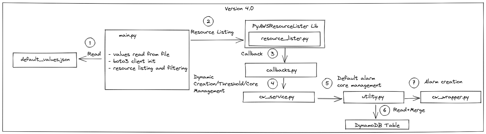
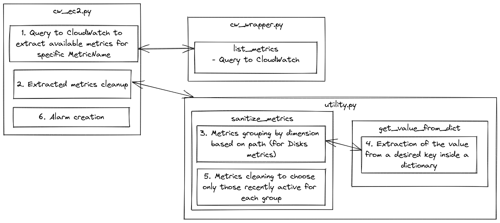

[[_TOC_]]

Code description for developers

# Basic Code Flow
For most alarms, the flow is as follows.



0. [File ``main.py``] environment variables initialization. See [Readme: Usage](./README.md#usage)

1. [File ``main.py`` Method ``lambda_handler``] Default values read from the file ``default_values.json``
```python
with open("default_values.json") as json_file:
    default_values = json.load(json_file)
```

2. [File ``main.py`` Method ``lambda_handler``] Specific client initialization for cloudwatch and for each monitored services.
```python
cloudwatchclient = boto3.client(
            "cloudwatch", region_name=os.environ["region"])

ec2client = boto3.client("ec2", region_name=os.environ["region"])
```
3. [File ``main.py`` Method ``lambda_handler``] Invoke listing method for each resource type (in multi threading), which is delegated to the [PyAWSResourceLister library](https://git.elmec.com/public-cloudservices/aws/pyawsresourcelister). Listing methods will filter all resources that have a specific tag with a specific value. In addiction they allow a series of parameters which allow the caller to:
    - filter resources (if ec2 and ebs using boto3 method's filter parameter, else manual check of equality. For more detail check the library documentation)
    - Reference to the callback method
    - Parameters that the list method has to pass to the callback
Here there is an example of code with filters that will be passed to boto3 method's filter 
```python
ec2 = Thread(target=resource_lister.list_ec2,
            args=(ec2client,
                [{"Name": "tag:" + event["filter_tag_key"], "Values": [event["filter_tag_value"]]}, {
                    "Name": "instance-state-name", "Values": ["pending", "running", "stopping", "stopped"]}],
                Callbacks.callback_ec2,
                (cloudwatchclient,  default_values["EC2"])))
```
Here there is an example of code with filters manually checked
```
rds = Thread(target=resource_lister.list_rds,
            args=(rdsclient,
                None, None,
                Callbacks.callback_rds, (cloudwatchclient, default_values["RDS"])))

```
4. [File ``callbacks.py`` method ``callback_<service>``] for each extracted resource is called the class ``CloudWatch<Service>`` inside ``cw_<service>.py`` for specific information extraction
```python
from cw_services.cw_acm import CloudWatchACM

@staticmethod
def callback_acm(certificates_list, cloudwatchclient, default_values):
    for acm in certificates_list:
        CloudWatchACM(acm, cloudwatchclient, default_values)
```

5. [File ``cw_<service>.py``] Logic which define monitoring alarms creation. Inside this file there are all Dynamic methods (DynamicCreation/Threshold/Core) if specified inside ``default_values.json``
```python
@staticmethod
def aurorareplicalag_creation_dynamic(database, alarm_values):
    """
    Creation condition for AuroraReplicaLag metrics
    :return: if the metrics needs to be created or not
    """
    # Metric available only in case of Replica
    return database.get("ReplicationSourceIdentifier", "") != ""

@staticmethod
def serverlesscapacity_threshold_dynamic(database, alarm_values):
    """
    Dynamic Threshold calculation for ServerlessCapacity metrics
    :return: Threshold value to be used
    """
    return database["ScalingConfigurationInfo"]["MaxCapacity"] - alarm_values["MetricSpecifications"]["Threshold"]

```

6. [File ``cw_<service>.py`` method ``__init__``]: resource information extraction and generation of monitoring list to apply 
```
ciname = ca["DomainName"]
cloudid = ca["CertificateArn"]

if "DynamicCore" in metric_needed[metric_name]["MetricSpecifications"]:
    getattr(CloudWatchRDS, metric_needed[metric_name]["MetricSpecifications"]["DynamicCore"])(
        database, dbidentifier, cloudwatchclient, default_values)
else:
    alarm_values = Utility.get_default_parameters(
        monitoring_id=metric_name,
        item_id=f"{dbtype}-{dbidentifier}",
        default_values=default_values)

Utility.default_core_method(metric_needed[metric_name],
                            CloudWatchRDS,
                            database,
                            dbidentifier,
                            dbarn,
                            alarm_values,
                            [{
                                "Name": dbtypedimension,
                                "Value": dbidentifier
                            }],
                            cloudwatchclient
                            )
```

7. [File ``utility.py`` method ``get_default_parameters``] Centralized reading and merge logic from default_json file and DynamoDB Table
```python
@staticmethod
def get_default_parameters(monitoring_id, default_values, item_id=None, item_id_components=None, cb=None, extra_params=None):
...
```

8. and call to the centralized method of creating alarms (except if ``DefaultCoreMethod`` is present)

9. [File ``cw_wrapper.py`` method ``create_metric_alarm``] alarm creation using information extracted and calculated from previous methods

# Specific Flow
- [File ``utility.py`` method ``get_name_from_kubetag``]: Method used to extract the name of the kubernetes cluster from the resource tag. The key has the following format: ``kubernetes.io/cluster/NAME``

- [File ``utility.py`` method ``search_item_with_and_without_hyphen``]: Method used to search a primary key inside DynamoDB table removing, if present, the final ``-`` at the end of the string. This method allows you to insert the primary key in DynamoDB Table as ``EC2-DiskUsage-nvme1n1p1`` or ``EC2-DiskUsage-nvme1n1p1-``

- [File ``cw_wrapper.py`` method ``replace_decimals``]: Method used to remove decimals from DynamoDB extracted values that are not supported on CloudWatch

## Memory Utilization and Disk Usage


1. [File ``cw_ec2.py`` method ``memusedpercent_core_dynamic``]: Custom code logic for MemoryUtilization Alarms. Extraction all available metrics
```python
memmetrics = CloudWatchWrapper.list_metrics(cloudwatchclient, {"Namespace": "CWAgent", "MetricName": "mem_used_percent",
    "Dimensions": [
        {"Name": "InstanceId", "Value": instance["InstanceId"]}],
    "RecentlyActive": "PT3H"})
```

2. [File ``cw_wrapper.py`` method ``list_metrics``]: Query to CloudWatch to extract available metrics for specific MetricName. Gets the metrics within a namespace that have the specified name. If the metric has no dimensions, a single metric is returned Otherwise, metrics for all dimensions are returned.
```python
metrics = cloudwatchclient.list_metrics(**kwargs)
```

3. [File ``cw_ec2.py`` method ``memusedpercent_core_dynamic``]: Extracted metrics cleanup
```python
sanitized_dimensions = Utility.sanitize_metrics(
    cloudwatchclient, memmetrics["Metrics"])
```

4. [File ``utility.py`` method ``sanitize_metrics``]: Metrics grouping by dimension based on path (for Disks metrics)
```python
 grouped_metric = {}
for metric in metrics:
    local_key = Utility.get_value_from_dict(
        metric["Dimensions"], "Name", "path", "Value")
    if local_key not in grouped_metric:
        grouped_metric[local_key] = []
    grouped_metric[local_key].append(metric)
```

5. [File ``utility.py`` method ``get_value_from_dict``]: Extraction of the value from a desired key inside a dictionary
    - array = [{'Name': 'path', 'Value': '/'}] 
    - key = Name
    - excepted_key_value = Path
    - excepted_value = Value
    - return: /
```python
for item in array:
            if item[key] == excepted_key_value:
                return item[excepted_value]
```

6. [File ``utility.py`` method ``sanitize_metrics``] Metrics cleaning to choose only those recently active for each group
```python
 metrics_data_results = cloudwatchclient.get_metric_data(
    MetricDataQueries=metric_data_queries,
    StartTime=datetime.now() - timedelta(hours=3),
    EndTime=datetime.now(),
    ScanBy="TimestampDescending"
)
# Extract metric whose last datapoint is most recent
for metrics_data_result in metrics_data_results["MetricDataResults"]:
    if len(metrics_data_result["Timestamps"]) > 0 and (tmp_metric_evaluator["metric"] is None or (tmp_metric_evaluator["metric"] is not None and metrics_data_result["Timestamps"][00] > tmp_metric_evaluator["max_timestamp"])):
        tmp_metric_evaluator["metric"] = local_metrics[int(
            metrics_data_result["Id"].split("_")[1])]
        tmp_metric_evaluator["max_timestamp"] = metrics_data_result["Timestamps"][00]
```