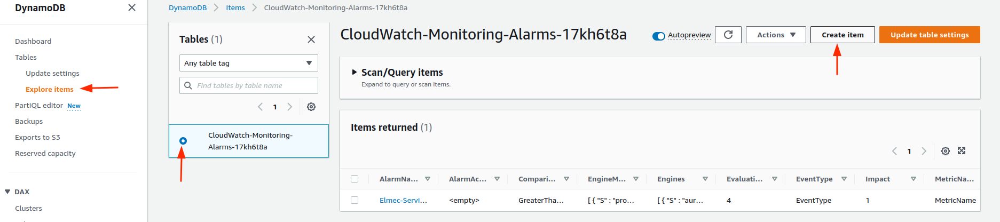
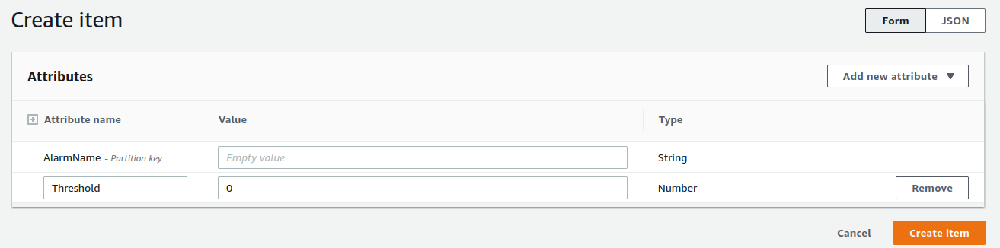
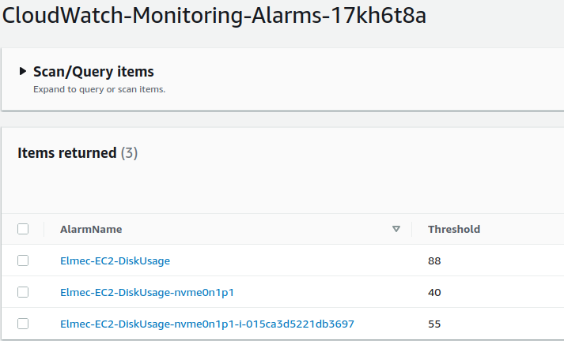

AWS monitoring

[[_TOC_]]

Scan AWS account (in a specific region) looking for supported resources with predefined tags and create monitoring alarms through CloudWatch.

# Supported resources
- EC2 Instances
- EKS Clusters
- RDS/Aurora Instances and Clusters
- EBS Volumes
- EFS FileSystems
- VPC Client VPN
- VPC SiteToSite VPN
- ELB (Application/Network)
- OpenSearch Domains
- ACM Certificates

# Usage
On your AWS account, in the same region:
- Tag all [supported resources](#supported-resources) in your AWS account with a specific tag. You can use [AWS Tag Editor](https://docs.aws.amazon.com/ARG/latest/userguide/tag-editor.html) to bulk apply tags.
- Create an [SNS Topic](https://docs.aws.amazon.com/sns/latest/dg/sns-create-topic.html) with a subscription for alarm notifications
- (Optional) Create a [DynamoDB Table](https://docs.aws.amazon.com/amazondynamodb/latest/developerguide/Introduction.html) for alarm granularity (see [Alarm Granularity](#alarm-granularity))

Where you want to run the script:
1. Make sure you have installed the [AWS CLI](https://docs.aws.amazon.com/cli/latest/userguide/getting-started-install.html) and are authenticated to your AWS Account
2. Export environment variables:
    - ``filter_tag_key``: Tag key applied to resources to be monitored
    - ``filter_tag_value``: Tag value applied to resources to be monitored
    - ``aws_region``: AWS region where to scan resources and apply monitoring
    - ``sns_topic_name``: SNS Topic name (or multiple names splitted with ;) used as destination for alarm/ok actions. Must be in the same region of the scanned resources.
    - ``aws_account_alias_key``: (Optional) Name of the label that can identify your AWS account. This key will be inside a JSON in  the "AlarmDescription". If ``aws_account_alias_value`` is exported, the default value of this variable will be **account_alias**
    - ``aws_account_alias_value``: (Optional) A custom alias for your AWS Account that will be shown inside a JSON in the "AlarmDescription"
    - ``alarm_prefix``: (Optional) Prefix used inside CloudWath alarm names. 
    > Changing Alarm Prexif will create new alarms
    - ``db_table_name``: (Optional) Name of the DynamoDB table used for alarm granularity (see [Alarm Granularity](#alarm-granularity))

Example for Windows Powershell:
```
$env:filter_tag_key="CWMon"
$env:filter_tag_value="yes"
$env:aws_region="eu-west-1"
$env:sns_topic_name="CloudWatchAlert"
$env:aws_account_alias_key="Env"
$env:aws_account_alias_value="Prod"
$env:alarm_prefix="MyAlarm"
$env:db_table_name="CloudWatch-Monitoring-Alarms"
```

Example for Linux:
```
export filter_tag_key="CWMon"
export filter_tag_value="yes"
export aws_region="eu-west-1"
export sns_topic_name="CloudWatchAlert"
export aws_account_alias_key="Env"
export aws_account_alias_value="Prod"
export alarm_prefix="MyAlarm"
export db_table_name="CloudWatch-Monitoring-Alarms"
```
3. Check if alarms defined in [``default_values.json``](./src/default_values.json) are correct for your use case (see [JSON format](#json-format)))
4. Make sure you have installed **Python** and PIP dependencies defined in [requirements](./requirements.txt):
```
pip install -r requirements.txt
```
5. Run [``main.py``](./src/main.py)
```
python main.py
```

# JSON format
Inside [``default_values.json``](./src/default_values.json) contains the information of each alarm to be created.
The file has the following structure.

## Example
```json
"AWSService":{
    "MonitoringID": {
        "MetricSpecifications": {
            "AlarmName": "Service-AlarmName-",
            "Threshold": 20,
            "Engines": [
                "aurora",
                "aurora-mysql",
                "aurora-postgresql"
            ],
            "EngineModes": [
                "provisioned",
                "serverless"
            ],
            "Types": [
                "instance"
            ],
            "DynamicCreation": "aurorareplicalag_creation_dynamic",
            "DynamicThreshold": "aurorareplicalag_threshold_dynamic",
            "DynamicCore": "cluster_failed_node_count_core_dynamic"
        },
        "MetricName": "MetricName",
        "ComparisonOperator": "GreaterThanThreshold",
        "EvaluationPeriods": 2,
        "Namespace": "AWS/Service",
        "Statistic": "Sum",
        "TreatMissingData": "breaching",
        "Period": 300,
        "OKActions":"",
        "AlarmActions": ""
    }
}
```

## Details
- AWS Service (EC2,RDS, ecc...)
    - MonitoringID: internal monitoring id in the format **Service_MetricName** (E.g. ``EC2_CPUUtilization``)
        - MetricSpecifications: additional information for alarm creation used inside the script at code level
            - "**DynamicCreation**": must point to a code method with the suffix "**creation_dynamic"** used to validate the condition of alarm creation. The method must return True o False in order to indicate if the alarm must be created or not for the considered resource. (E.g. method used to check if the EC2 instance type is T* so it must be applied alarm for burst credit balance)
            - "**DynamicThreshold**": must point to a code method with the suffix "**threshold_dynamic"** used to calculate threshold for a specific alarm.
            The method must return an integer value used as Threshold. (E.g. method used to calculate threshold in percentage for disk usage when CloudWath Alarm must be in number of used bytes)
            - "**DynamicCore**": must point to a code method with the suffix "**core_dynamic**" used to manage the alarm creation logic.
        - [All CloudWatch Boto3 supported options](https://boto3.amazonaws.com/v1/documentation/api/latest/reference/services/cloudwatch.html#CloudWatch.Client.put_metric_alarm)

# Notifications
The destination of alarm notifications is defined as follows: 
- By default it uses the SNS Topic specified in the environment variable ``sns_topic_name`` for alarm and ok notifications
- When using ``OKActions`` (for ok notifications) and ``AlarmActions`` (for alarm notifications) inside the alarm definition parameters, the environment variable ``sns_topic_name`` is overwritten with:
    - an empty string (in default_values: ``""``, in DynamoDB keep blank: ``empty value``); in this case the alarm will not send any notifications
    - a different **ARN**; in this case the ARN specified in ``OKActions`` or ``AlarmActions`` will overwrite ``sns_topic_name``

# Alarm Granularity
Alarm definitions inside ``default_values.json`` can be ovewritten for specific resources or resource types.

In order to do this, it is necessary to create a DynamoDB Table and set the corresponding variable ``os.environ["db_table_name"]`` with the table name.
Each table row should be created with:
- a Primary Key called "AlarmName" and, as value, the name of the alarm you want to overwrite
- a column for each alarm option you want to overwrite.
    - attribute name: alarm option name (E.g. Threshold)
    - value: the modified value





## Examples
- Overrides the threshold for each disk of each instance

|AlarmName|Threshold|
|------------|----------|
|EC2-DiskUsage|88|

- Overrides the threshold for a specific disk for each instance

|AlarmName|Threshold|
|------------|----------|
|EC2-DiskUsage-nvme1n1p1|40|

- Overrides the threshold for a specific disk and instance

|AlarmName|Threshold|
|-----------|-------------------|
|EC2-DiskUsage-nvme1n1p1-i-015ca3d5221db3697|55|



**In case of overlapping rules, the more specific one is preferred**

Using all 3 examples listed above: 
1. With the instance ID ``i-015ca3d5221db3697``, the threshold for the alarm of the disk ``nvme1n1p1`` will be **55**
2. For each instance (except for ``i-015ca3d5221db3697``), the threshold for every alarm of each disk ``nvme1n1p1`` will be **40**
3. In every case different from **1.** **2.** above, the threshold will be **88**

# Custom Alarms
- **CloudWatch Threshold** = final threshold used on alarm in CloudWatch
- **User Defined Threshold** = threshold set in default_values or DynamoDB Table

In ``default_values.json`` there are alarm definitions with specific logic:
- ``EC2_mem_used_percent``: a custom method (DynamicCore) extracts dimensions from memory metrics sent to CloudWatch, through the CloudWatch Agent, in the last 3 hours
- ``EC2_disk_used_percent``: a custom method (DynamicCore) extracts dimensions from each disk metrics sent to CloudWatch, through the CloudWatch Agent, in the last 3 hours
    - only disks that don't have **fstype** ``"tmpfs", "overlay", "nfs4", "devtmpfs"`` and ``"kubelet"`` inside the **path** will be considered
- ``EC2_CPUCreditBalance``: only ``T*`` instances will have this alarm
- **RDS** alarms: additional checks for instances and cluster that must match Engines, EngineModes and Types combination
- ``RDS_AuroraReplicaLag`` and ``RDS_ReplicaLag``: Alarm created only if resource has ``"ReplicationSourceIdentifier"`` or ``"ReadReplicaSourceDBInstanceIdentifier"`` valued. These resource attributes contain the identifier of the source DB cluster if this DB cluster is a [read replica](https://aws.amazon.com/rds/features/read-replicas/).
- ``RDS_BurstBalance``: only RDS with ``GP2`` disks will have this alarm
- ``RDS_CPUCreditBalance``: only ``T*`` instances and clusters will have this alarm
- ``RDS_DatabaseConnections``: **CloudWatch Threshold** is calculated in percentage starting from **User Defined Threshold** with a specific formula based on memory size info (extracted using EC2 ``describe_instance_types``). [Formulas detailed on AWS Docs](https://docs.aws.amazon.com/AmazonRDS/latest/UserGuide/CHAP_Limits.html#RDS_Limits.MaxConnections)
- ``RDS_FreeStorageSpace``: **CloudWatch Threshold** is calculated in percentage starting from **User Defined Threshold** based on the attribute ``"AllocatedStorage"`` with 25% reserved for the OS
- ``RDS_ServerlessDatabaseCapacity``: **CloudWatch Threshold** is calculated starting from **User Defined Threshold** based on actual Scaling Configuration Info (``MaxCapacity - User Defined Threshold``) of the database. If MaxCapacity is < 1 or MinCapacity = MaxCapacity the alarm won't be created.
- ``EFS_BurstCreditBalance``: Alarm created only if the attribute ``"ThroughputMode"`` is ``"bursting"`` with a **CloudWatch Threshold** calculated based on attribute ``SizeInBytes`` of the FileSystem. [See AWS Docs](https://docs.aws.amazon.com/efs/latest/ug/performance.html#bursting)
- ``EBS_BurstBalance``: Alarm created only for specific Volume Types ``"gp2", "st1" and "sc1"``
- ``EKS_cluster_failed_node_count``: Cluster must have **Container Insights** enabled and at least one persistent disk
- ``OpenSearch_FreeStorageSpace``: **CloudWatch Threshold** is calculated in percentage starting from **User Defined Threshold** with 25% of space reserved ([See AWS Docs](https://docs.aws.amazon.com/opensearch-service/latest/developerguide/sizing-domains.html))

Additionally, in ``main.py`` some types of resources are filtered out during listing:
- **EC2**: Only instances in state ``"pending", "running", "stopping", "stopped"`` will be considered
- **EBS**: Only volumes in state ``"in-use"`` will be considered
- **ACM**: Only certificates with ``RenewalEligibility`` equals to ``"INELIGIBLE"`` will be considered

# Alarm Description
By default the description of the alarms contains a json with the following information:
- ``aws_account_alias_key: aws_account_alias_value``: a custom alias for your AWS Account (See Environment Variables in [Usage](#usage))
- ``CI``: name of the configuration item that manages that resource (See [Configuration Item](#configuration-item-ci))
- ``CloudID``: identifier of the configuration item that manages that resource (See [CloudID](#cloudid))

## Configuration Item (CI)
The "Configuration Item" is defined inside the code with the following rules:
- ACM: resource ``DomainName`` 
- EBS: tag ``Name`` EC2 which it is associated
- EC2
    - If managed by EKS (has tag ``eks:cluster-name``): EKS Cluster Name
    - If managed by Autoscaling Group (has tag ``aws:autoscaling:groupName``): Autoscaling Group name
    - Otherwise: EC2 Instance Tag ``Name``
- EFS: resource tag ``Name`` 
- EKS: resource tag ``Name`` 
- ELB
    - If managed by EKS (has tag ``eks:cluster-name`` or ``kubernetes.io/cluster/``): EKS Cluster Name 
    - Altrimenti: resource ``LoadBalancerName`` 
- OpenSearch: resource ``DomainName`` 
- RDS: resource ``DBInstanceIdentifier`` or ``DBClusterIdentifier`` 
- VPN: resource ``VpnConnectionId`` 

## CloudID
"CloudID" attribute is defined inside the code with the following rules:
- ACM: resource ``CertificateArn`` 
- EBS: ``InstanceId`` EC2 which it is associated
- EC2
    - If managed by EKS (has tag ``eks:cluster-name``): EKS cluster ARN
    - If managed by Autoscaling Group (has tag ``aws:autoscaling:groupName``): Autoscaling Group ARN
    - Otherwise: EC2 Instance ARN
- EFS: resource ``FileSystemId`` 
- EKS: Cluster ``arn``
- ELB
    - If managed by EKS (has tag ``eks:cluster-name`` or ``kubernetes.io/cluster/``): EKS Cluster ARN 
    - Altrimenti: resource ``LoadBalancerARN``
- OpenSearch: resource ``ARN``
- RDS: resource ``DBInstanceArn`` or ``DBClusterArn`` 
- VPN: resource ``VpnConnectionId`` 

# License
This project is made available under the terms of the [GPLv3](https://www.gnu.org/licenses/gpl-3.0.html)

See the [LICENSE](./LICENSE) file that accompanies this distribution for the full text of the license.